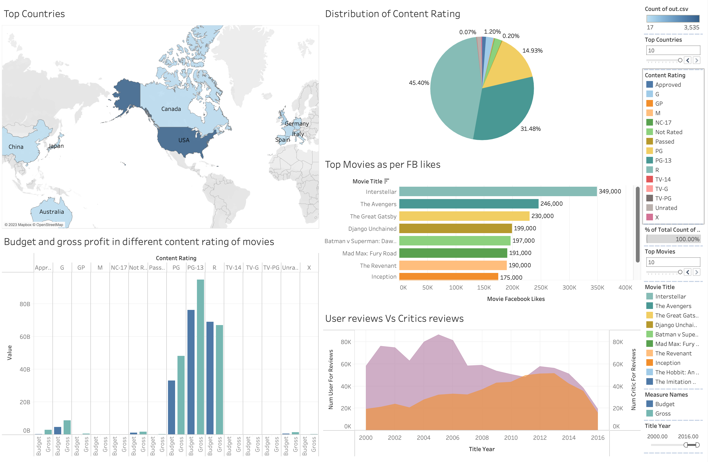

# EDA of IMDB 5000 Data

## Overview
This dataset includes the highest rated films from the IMDb website that have been collected based on various genres and languages.
## Description
EDA of the IMDB 5000 movies dataset. The dataset contains information about  different types attributes like movie genres, director, actor, FB likes, ratings.

## [Dashboard](https://public.tableau.com/app/profile/aakansha.goyal/viz/IMDB_16726064011150/Dashboard1?publish=yes)

### [Data Source](https://www.kaggle.com/datasets/carolzhangdc/imdb-5000-movie-dataset)
